# Тестування працездатності системи

*В цьому розділі необхідно вказати засоби тестування, навести вихідні коди тестів та результати тестування.*
*Тестування виконується за допомогою Postman*
*Для авторизації використовуються JWT токени. У кожному запиті Користувача або Адміністратора в Headers додається Authorization з токеном*

## GET

### Отримати всі дані - Гість

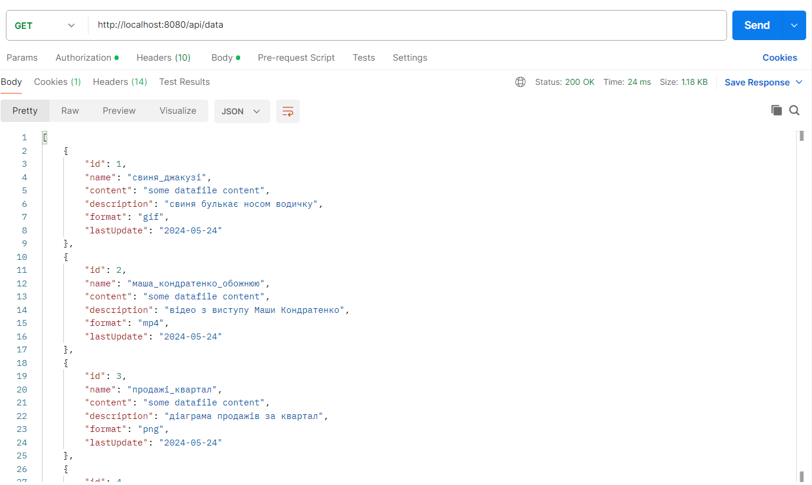

### Отримати всі запити (виводяться запити користувача) - Користувач

### Отримати всі запити (виводяться запити всіх користувачів) - Адміністратор

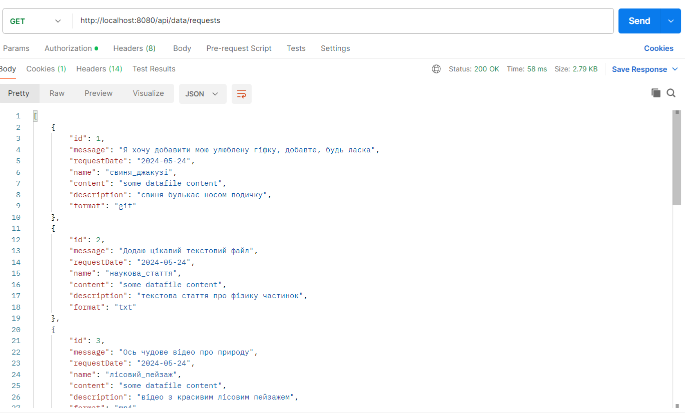

### Отримати дані користувача - Користувач

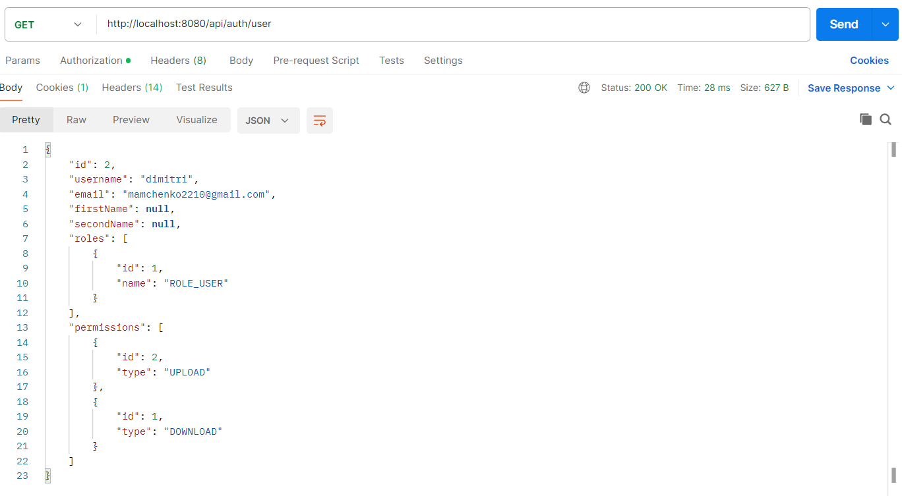

## POST

### Схвалити запит - Адміністратор

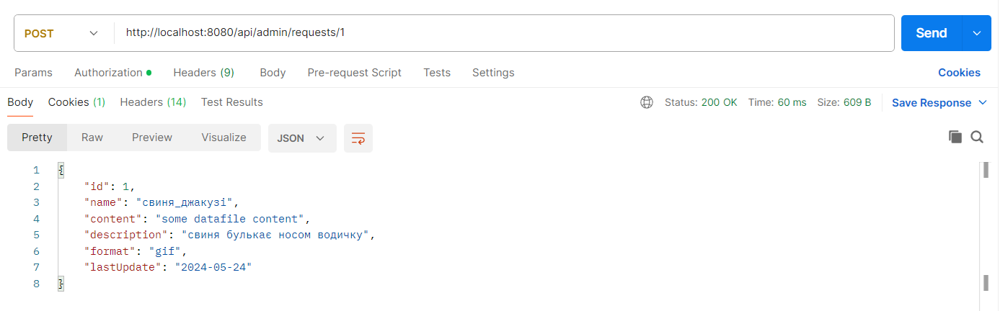

### Відхилити запит - Адміністратор

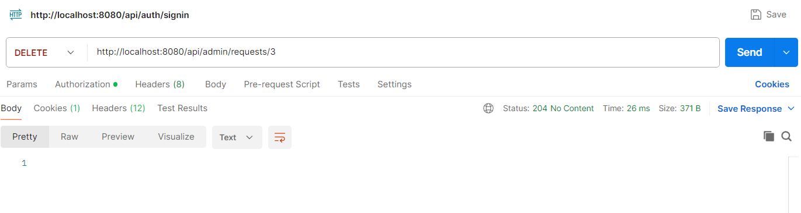

### Зареєстуватись - Гість

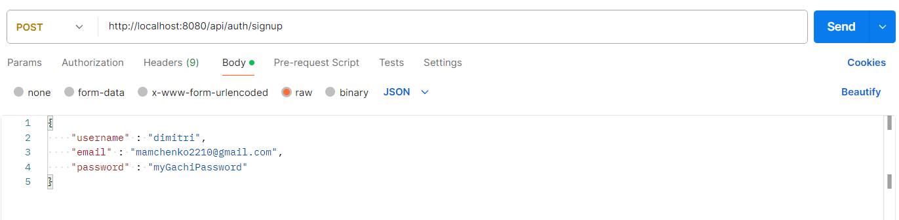
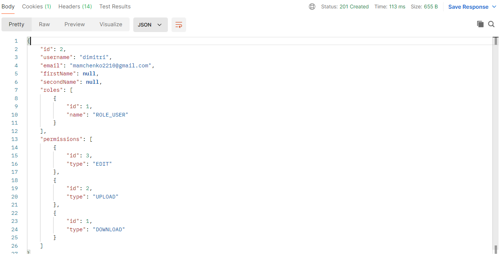

### Авторизуватись - Гість

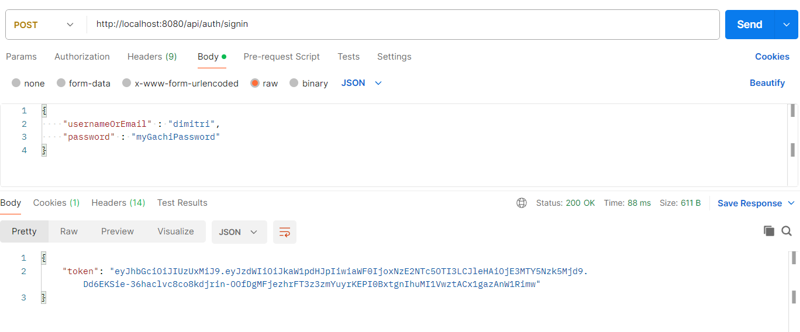

### Відправити запит - Користувач

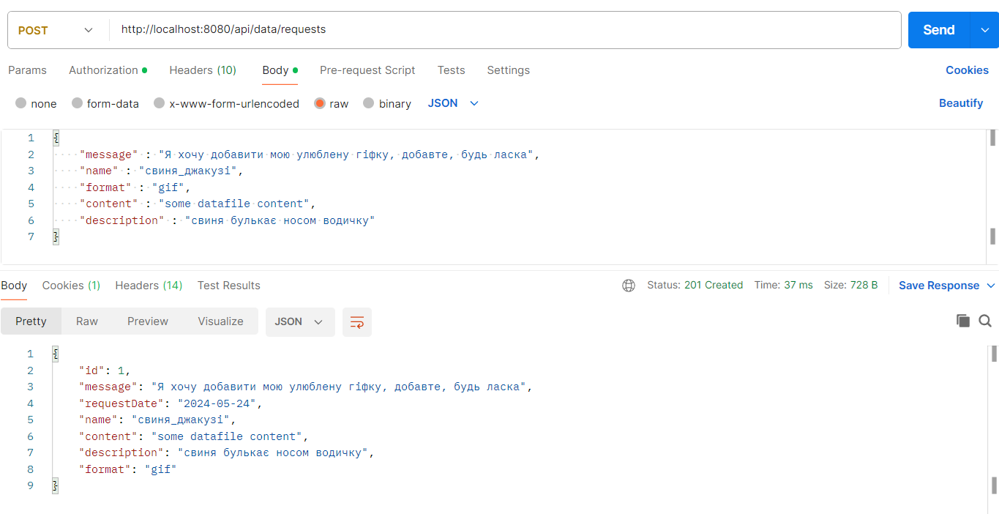

## PATCH

### Добавити дозволи користувачу - Адміністратор

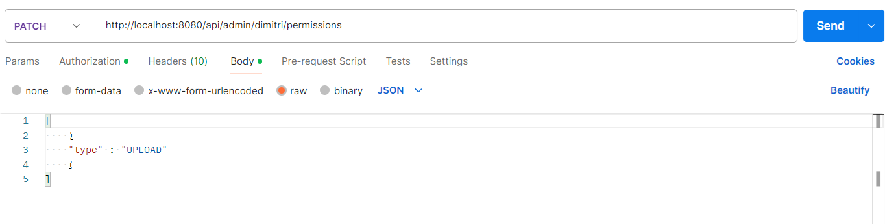
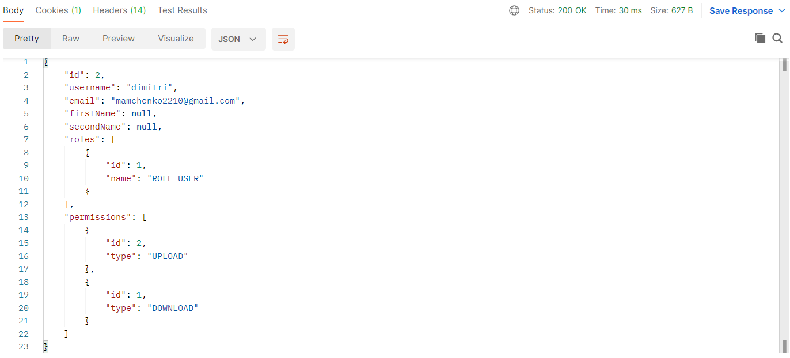

### Оновити профіль користувача - Користувач

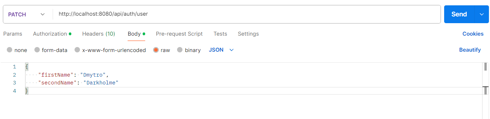
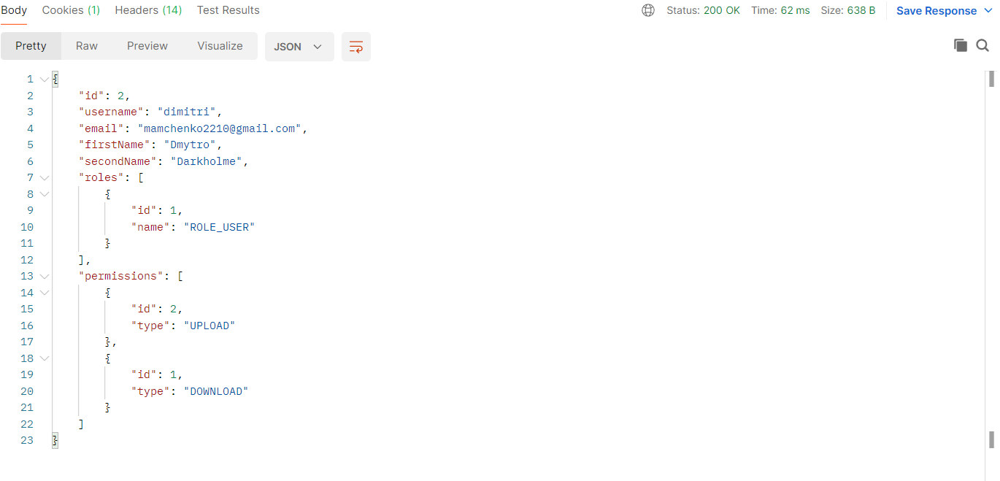

## DELETE

### Видалити дозволи користувача - Адміністратор

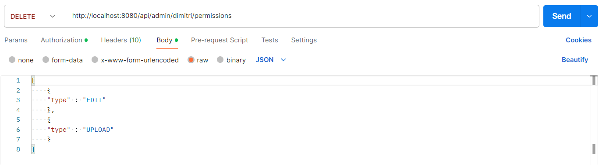
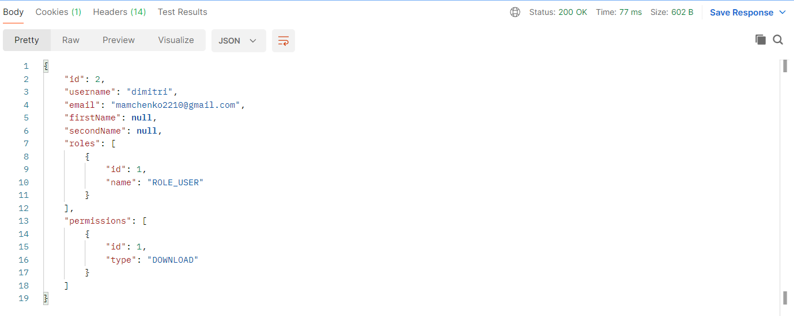
